# FactoryShield-OT — Architecture Guide
### Granular Technical Reference · End-to-End System Documentation

> **Version:** 1.0 · **Standard:** ISA/IEC 62443 · **Dataset:** HAIEnd 23.05  
> **Author:** Senior Lead Architect Documentation · EMSI Internship Project

---

## Table of Contents

1. [Executive Summary & Problem Framing](#1-executive-summary--problem-framing)
2. [Scientific & Algorithmic Choices](#2-scientific--algorithmic-choices)
3. [File-by-File Code Walkthrough](#3-file-by-file-code-walkthrough)
   - 3.1 [configs/hyperparameters.yaml](#31-configshyperparametersyaml)
   - 3.2 [configs/config_loader.py](#32-configsconfig_loaderpy)
   - 3.3 [src/data/preprocess.py](#33-srcdatapreprocesspy)
   - 3.4 [src/data/dataloader.py](#34-srcdatadataloaderpy)
   - 3.5 [src/data/make_splits.py](#35-srcdatamake_splitspy)
   - 3.6 [src/models/lstm_autoencoder.py](#36-srcmodelslstm_autoencoderpy)
   - 3.7 [src/models/train.py](#37-srcmodelstrainpy)
   - 3.8 [src/models/inference.py](#38-srcmodelsinferencepy)
   - 3.9 [src/detection/inference.py](#39-srcdetectioninferencepy)
   - 3.10 [src/detection/xai_root_cause.py](#310-srcdetectionxai_root_causepy)
   - 3.11 [src/detection/risk_scoring.py](#311-srcdetectionrisk_scoringpy)
   - 3.12 [src/utils/metrics.py](#312-srcutilsmetricspy)
   - 3.13 [app/app.py](#313-appapppy)
   - 3.14 [notebooks/legacy_train.py & legacy_evaluate.py](#314-notebookslegacy_trainpy--legacy_evaluatepy)
4. [End-to-End Data Pipeline Flowchart](#4-end-to-end-data-pipeline-flowchart)
5. [Mathematical Reference Manual](#5-mathematical-reference-manual)
6. [Experiment Matrix & Model Zoo](#6-experiment-matrix--model-zoo)
7. [Deployment & Configuration Reference](#7-deployment--configuration-reference)

---

## 1. Executive Summary & Problem Framing

### 1.1 The Industrial Cybersecurity Gap

Traditional IT cybersecurity tools — firewalls, antivirus, SIEM on network traffic — operate at OSI Layers 3–7. They answer one question: *Is this packet/file malicious?*

Operational Technology (OT) attacks are fundamentally different. A sophisticated adversary targeting a thermal power plant does not send a recognizable virus. Instead, they issue a perfectly valid Modbus write command that changes a valve calibration coefficient by 3%. The network packet is indistinguishable from a legitimate operator command. The antivirus sees nothing. The firewall passes it through.

What *does* change is physics. A 3% bias on a flow control valve immediately distorts the pressure-temperature-flow relationship that has held for thousands of hours of normal operation. The boiler's thermodynamic fingerprint is broken.

**FactoryShield-OT monitors the physics, not the packets.**

It operates at **Level 1 (Process Control)** of the Purdue Model — inside the DCS, watching 225 simultaneous sensor/actuator readings every second and asking: *"Does this physical state make thermodynamic and control-loop sense?"*

### 1.2 Physical Testbed Architecture

The HAIEnd 23.05 dataset was produced by a Hardware-in-the-Loop (HIL) testbed with four interconnected physical processes:

| Process | System | Description |
|---------|--------|-------------|
| **P1 — Boiler** | Emerson Ovation DCS | Primary target. 5 control loops: Pressure (PC), Level (LC), Flow (FC), Temperature (TC), Cooling (CC). 225 data points: 35 SCADA I/O tags + 190 internal control logic function block edges. |
| **P2 — Steam Turbine** | GE Mark VIe | Speed control, valve management, turbine protection logic. |
| **P3 — Water Treatment** | Siemens S7-300 PLC | Pumped-storage hydropower plant: flow, level, pump control. |
| **P4 — HIL Simulator** | dSPACE SCALEXIO | Real-time physical simulation of the plant dynamics, feeding sensor signals back to real controllers. |

The Emerson Ovation DCS controlling P1 is the primary attack surface. Its five control loops are:

1. **P1-PC (Pressure Control):** Maintains pressure between main and return tanks. Tags: `PIT01` (sensor), `PCV01D`/`PCV02D` (valves), `B2016` (setpoint).
2. **P1-LC (Level Control):** Maintains return tank water level. Tags: `LIT01` (sensor), `LCV01D` (valve), `B3004` (setpoint).
3. **P1-FC (Flow Control):** Controls outflow rate. Tags: `FT03` (sensor), `FCV03D` (valve), `B3005` (setpoint).
4. **P1-TC (Temperature Control):** Cascade/feedforward heat exchanger temperature control. Tags: `TIT01` (sensor), `FCV01D`/`FCV02D` (valves), `B4022` (setpoint).
5. **P1-CC (Cooling Control):** Controls cooling pump frequency. Tags: `TIT03` (temperature), `PP04` (pump).

### 1.3 Dataset: HAIEnd 23.05 vs. HAI 23.05

| Property | HAIEnd 23.05 | HAI 23.05 |
|----------|-------------|-----------|
| Features | **225** (SCADA I/O + internal function block edges) | **86** (SCADA I/O only) |
| Scope | Full DCS internals exposed | External sensor/actuator tags only |
| Attack vectors covered | I/O AP01–AP47 + Internal Logic AE01–AE08 | I/O AP01–AP47 only |
| Clean training samples | 896,400 | ~850,000 |
| Attack ratio in test | ~4% | ~4% |
| Recommended model | LSTM Autoencoder (captures internal correlations) | Classical ML or LSTM |

**Attack taxonomy:**

- **AP01–AP47 (I/O Point Attacks):** Direct manipulation of Setpoints (SP), Process Variables (PV), and Control Outputs (CV). Sub-types include short-term impulse attacks (ST), trapezoidal masking profiles, and long-term bias attacks (LT).
- **AE01–AE08 (Internal Logic Attacks):** Target Emerson Ovation function block algorithms:
  - *AE01, AE03:* Artificial I/O — modulate valve initial state during auto/manual switching.
  - *AE02, AE04–AE07:* Arithmetic — alter sensor calibration curves and output scaling limits (e.g., cap max valve open command from 100% to 90%).
  - *AE08:* Monitor — alter safety trip threshold limits to suppress/trigger false alarms.

### 1.4 Project Positioning

FactoryShield-OT answers the HAICon 2021 competition challenge: detect all 55 attack types (AP + AE) on a live ICS testbed with minimal false positives. The winning strategy from HAICon 2021 — and the one implemented here — is **semi-supervised normality learning**: train exclusively on clean data, flag anything the model cannot reconstruct.

---

## 2. Scientific & Algorithmic Choices

### 2.1 Rejection of Synthetic Oversampling (No SMOTE)

A naive approach to the severe class imbalance (~4% attacks, ~96% normal) would be to use SMOTE (Synthetic Minority Over-Sampling Technique) to generate artificial attack samples. This is explicitly rejected for a fundamental reason:

**SMOTE generates thermodynamically impossible states.**

SMOTE interpolates between real attack samples in feature space. But industrial sensor data is governed by physical conservation laws (energy conservation, mass conservation, thermodynamic state equations). A SMOTE-generated sample might produce, for example:

- Pressure sensor `PIT01` = 80 bar
- Valve `PCV01D` position = 5% open
- Flow `FT03` = 150 m³/h

This combination violates basic fluid dynamics — 5% open valve cannot produce 150 m³/h flow at 80 bar. A model trained on such states learns false physics and becomes unreliable on real plant data.

The mathematically sound alternative is to let the model learn only valid physical states from the 896,400 clean samples, then detect departures from those states at inference time.

### 2.2 Semi-Supervised "Normality Learning" Approach

The model is trained **exclusively on 896,400 clean, normal-operation samples**. No attack samples are ever seen during training. This is the semi-supervised paradigm:

```
Training phase:  Model learns P(normal | X)
                 Objective: reconstruct X from compressed representation
                 Loss:       L1(X, X̂) → minimize reconstruction error on normal data

Inference phase: For any incoming sample:
                 if L1(X, X̂) > threshold → ANOMALY (physics violated)
                 else                    → NORMAL
```

This approach has three critical advantages over supervised methods:

1. **Attack-agnostic:** Detects any deviation from normality, including zero-day attacks not present in the training set.
2. **Physics-faithful:** The model's internal representation captures real thermodynamic correlations.
3. **No labeling required:** The 896,400 clean training samples require no manual attack labeling.

The trade-off is that false positives during genuine process upsets (legitimate setpoint changes, maintenance transitions) require threshold tuning, which is handled by the EMA smoother and the 99th-percentile dynamic threshold.

### 2.3 The (Batch, 60, 225) Sliding Window Tensor

Raw data arrives as a 2D matrix of shape (N_samples, 225). An LSTM requires 3D temporal sequences. The window is constructed as follows:

**Why T = 60 seconds?**

- HAIEnd 23.05 is sampled at 1 Hz (one row per second).
- The Emerson Ovation DCS control loops have response times in the range of 10–120 seconds.
- A 60-second window captures at least one complete control loop response cycle, ensuring the LSTM sees correlated cause-and-effect physics (e.g., a valve command at t=0 and its pressure response at t=15).
- Shorter windows miss delayed physical effects; longer windows increase memory and computational cost without proportional benefit.

**Why Stride = 1?**

- In real-time monitoring semantics, a new decision must be made every second. Stride = 1 produces one anomaly score per incoming sample.
- Stride > 1 (e.g., stride = 10) is offered as a CPU optimization flag (`--stride 10` reduces the number of training windows by 10×) but is not used in deployment.

**Memory efficiency:** `SlidingWindowDataset` uses `torch.as_tensor()` which creates a **view** over the underlying numpy array without copying data. Each `__getitem__` call returns a slice reference. A dataset of 896,400 samples × 225 features × float32 = ~810 MB; with stride=1 and window=60, there are ~896,340 windows but only the 810 MB base array is held in RAM.

**Tensor shape:** `(Batch=64, Time=60, Features=225)` — the standard PyTorch `batch_first=True` format consumed by `nn.LSTM`.

---

## 3. File-by-File Code Walkthrough

### 3.1 `configs/hyperparameters.yaml`

**Path:** `configs/hyperparameters.yaml`  
**Purpose:** Single source of truth for all tunable parameters across the entire pipeline. Loaded at runtime by `config_loader.py` and by `train.py` via `--config` CLI flag.

**Key sections and values:**

```yaml
data:
  window_size: 60          # T — sliding window length in timesteps
  stride: 1                # Overlap between consecutive windows
  scaler_type: "minmax"    # MinMaxScaler(feature_range=[0,1])
  fit_on_normal_only: true # CRITICAL — prevents data leakage

lstm_autoencoder:
  hidden_size: 128         # Encoder layer 1 and Decoder layer 1 hidden dim
  latent_dim: 64           # Bottleneck size (note: YAML says 32, code uses 64)
  learning_rate: 0.001     # Adam optimizer LR
  batch_size: 64           # Mini-batch size
  epochs: 50               # Max training epochs
  loss_function: "l1"      # MAE — identical to inference error metric
  n_features: 225          # HAIEnd 23.05 feature count

detection:
  ema_alpha: 0.1           # α = 0.10 for EMA smoothing
  percentile_threshold: 99.0  # p99 threshold on training errors

risk_scoring:
  thresholds:
    low: 0.0
    medium: 0.3
    high: 0.6
    critical: 0.85
  factors:
    error_magnitude: 0.6   # 60% weight in composite risk score
    error_duration: 0.2    # 20% weight
    affected_sensors: 0.1  # 10% weight
    sensor_criticality: 0.1 # 10% weight

xai:
  root_cause:
    top_k_features: 5      # Top-K sensors displayed per alert onset

experiments:
  clean_100:               # 100% normal training data
    contamination: 0.01
    use_supervised_models: false
  mixed_70_30:             # 70% normal + 30% anomalous training data
    contamination: 0.30
    use_supervised_models: true  # Enables RF + XGBoost
```

**Design safeguard:** The `fit_on_normal_only: true` flag is the most critical parameter in the file. If inadvertently set to `false`, the MinMaxScaler would be fitted on test attack samples, causing data leakage where the scaler's range is influenced by abnormal states. The preprocessor enforces this constraint with a runtime check.

---

### 3.2 `configs/config_loader.py`

**Path:** `configs/config_loader.py`  
**Purpose:** Typed Python interface to `hyperparameters.yaml`. Provides structured access to configuration values via Python dataclasses, with validation, default fallbacks, and serialization.

**Key classes:**

| Class | Fields | Purpose |
|-------|--------|---------|
| `DataConfig` | `window_size`, `stride`, `scaler_type`, `fit_on_normal_only`, `imputation_method`, `features_haiend` | Data pipeline parameters |
| `LSTMConfig` | `hidden_size`, `latent_dim`, `batch_size`, `epochs`, `lr`, `loss_function` | Model architecture & training |
| `BaselineConfig` | `isolation_forest`, `oneclass_svm`, `random_forest`, `xgboost` | Classical model hyperparameters (nested dicts) |
| `DetectionConfig` | `ema_alpha`, `threshold_method`, `percentile_threshold`, `min_alert_duration` | Inference pipeline |
| `RiskScoringConfig` | `thresholds`, `factors`, `critical_sensors` | Risk engine |
| `XAIConfig` | `top_k_features`, `error_threshold` | Root-cause analysis |
| `FactoryShieldConfig` | Aggregates all above + `paths`, `performance`, `logging` | Master config object |

**Key methods:**

```python
FactoryShieldConfig.from_yaml(config_path)  # Loads YAML → dataclass
FactoryShieldConfig.from_dict(config_dict)  # Dict → dataclass (used internally)
FactoryShieldConfig.to_dict()               # Dataclass → dict (for serialization)
FactoryShieldConfig.save_yaml(config_path)  # Persists current config back to YAML

get_config(config_path)  # Module-level singleton factory
set_config(config)       # Replaces the global singleton
```

**Singleton pattern:** `get_config()` maintains a module-level `_config_instance`. The first call reads the YAML file; subsequent calls return the cached instance. This prevents repeated I/O and ensures all modules share the same configuration state during a run.

**Graceful degradation:** If `PyYAML` is not installed, the loader falls back to `json.load()` with a warning. If the YAML file itself is missing, all defaults from the dataclass field definitions are used, ensuring the system remains functional without configuration.

---

### 3.3 `src/data/preprocess.py`

**Path:** `src/data/preprocess.py`  
**Purpose:** Dual-mode data transformer. Converts raw `HAIDataLoader` output into either (a) 2D tabular matrices for classical ML or (b) 3D sliding-window tensors for LSTM. Implements the critical data-leakage prevention safeguard.

**Core class: `HAIPreprocessor`**

**Initialization:**
```python
HAIPreprocessor(scaler_type: Literal["standard", "minmax"] = "standard")
```
Instantiates either `StandardScaler` (zero-mean, unit-variance) or `MinMaxScaler` ([0,1] range). Raises `HAIPreprocessorError` for invalid types.

---

#### Method: `fit_transform_tabular()`

```python
def fit_transform_tabular(
    df, feature_cols=None, label_col=None,
    is_train=True, fit_on_normal_only=False
) -> Tuple[np.ndarray, Optional[np.ndarray]]
```

**Step-by-step internal logic:**

1. **Feature column resolution:** If `feature_cols=None`, all numeric columns except `label_col` are selected automatically.

2. **Existence validation:** Raises `HAIPreprocessorError` if any specified column is absent from the DataFrame.

3. **Temporal imputation (ffill/bfill):**
   ```python
   features_df = df[feature_cols].ffill().bfill()
   ```
   **Why ffill/bfill, not mean imputation?**  
   Industrial sensor data is temporally autocorrelated. A missing reading at t=500 is most accurately estimated by the reading at t=499 (forward fill), not by the global mean of the entire dataset. Mean imputation would introduce phantom "average" states that do not correspond to any physical reality and would bias the scaler. If any column is entirely NaN after ffill/bfill (completely absent), a `HAIPreprocessorError` is raised with the column names listed.

4. **Data leakage prevention — fit-on-normal-only:**
   ```python
   if fit_on_normal_only:
       normal_mask = (y == 0)
       self.scaler.fit(features_df.loc[normal_mask])
   else:
       self.scaler.fit(features_df)
   ```
   When `fit_on_normal_only=True`, the scaler computes its statistics (min/max or mean/std) **only on rows where label == 0**. The subsequent `transform()` is applied to all rows. This ensures that attack samples — which have abnormal sensor ranges — cannot influence the normalization boundaries. An attack sample with a valve at 200% of its normal range would, if included in the fit, extend the scaler's max bound, causing normal samples to compress toward 0 and making anomalies appear less extreme after scaling.

5. **Feature column memorization:**
   ```python
   self.feature_cols_ = list(feature_cols)
   ```
   Stored so that inference-time calls (`is_train=False`) can validate column consistency.

6. **Inference-time column consistency check:**
   ```python
   if list(feature_cols) != self.feature_cols_:
       raise HAIPreprocessorError(...)
   ```
   Guards against deploying a model trained on 225 features against a CSV with 86 features (HAI 23.05 vs. HAIEnd 23.05 mismatch).

**Returns:** `(X_scaled, y)` — float64 matrix + int label vector (or None).

---

#### Method: `create_sliding_windows()`

```python
def create_sliding_windows(
    X_scaled, y=None, window_size=30, step=1
) -> Tuple[np.ndarray, Optional[np.ndarray]]
```

**Implementation detail — zero-copy stride tricks:**
```python
raw_windows = sliding_window_view(X_scaled, window_shape=window_size, axis=0)
# Shape: (n_samples - window_size + 1, n_features, window_size)
windows = np.swapaxes(raw_windows, 1, 2)[::step]
windows = np.ascontiguousarray(windows)
```

`numpy.lib.stride_tricks.sliding_window_view` creates a **view** over the underlying array memory by manipulating strides (the byte offsets between elements). No data is copied during the view creation. The `swapaxes` reorders from `(N, F, T)` to `(N, T, F)` — the PyTorch `batch_first=True` expected format. Only `np.ascontiguousarray()` triggers a memory copy to produce a contiguous C-order layout required by PyTorch.

**Label windowing logic:**
```python
raw_label_windows = sliding_window_view(y_arr, window_shape=window_size, axis=0)
y_windows = (label_windows.max(axis=1) > 0).astype(int)
```
A window is labeled anomalous (1) if **any single timestep** within it is anomalous. This is the conservative choice: any contamination in the window is flagged. The alternative (majority vote) risks missing short attacks that occupy only a few seconds of a 60-second window.

---

#### Methods: `save_scaler()` / `load_scaler()`

Uses `joblib.dump/load` to persist the fitted scaler as a dict payload:
```python
{"scaler": self.scaler, "scaler_type": "minmax", "feature_cols": [...]}
```
The `feature_cols` are stored alongside the scaler so that any future `load_scaler()` call can re-validate column consistency without requiring the original training data.

---

### 3.4 `src/data/dataloader.py`

**Path:** `src/data/dataloader.py`  
**Purpose:** Pure data ingestion and structural inspection. Handles CSV loading, timestamp parsing, column normalization, label detection, and quality reporting. **Does not transform data numerically** — that responsibility belongs to `preprocess.py`.

**Core class: `HAIDataLoader`**

```python
HAIDataLoader(filepath: Union[str, Path])
```
Immediately loads the CSV on instantiation.

**Internal `_load()` method — step by step:**

1. **File existence check** → `HAIDataLoaderError` if absent.
2. **`pd.read_csv()`** → `HAIDataLoaderError` on `EmptyDataError` or any parse failure.
3. **Column name strip:** `df.columns = [str(c).strip() for c in df.columns]` — removes leading/trailing whitespace from column headers (common issue with HAI CSV exports).
4. **Timestamp detection:** Searches for case-insensitive "timestamp" or "time" column name.
5. **`pd.to_datetime()` conversion** with `errors="coerce"` → any unparseable timestamp becomes NaT. Raises `HAIDataLoaderError` if any NaT values result.
6. **Chronological sort:** `df.sort_values(by=self.timestamp_col)` ensures temporal ordering even if the CSV was exported in non-chronological order.
7. **Attack label column detection:** `re.compile(r"attack", re.IGNORECASE)` matches any column whose name contains "attack" (e.g., `Attack`, `Attack_P1`, `Attack_P2`, `attack_label`).

**Key methods:**

| Method | Output | Notes |
|--------|--------|-------|
| `get_summary()` | Dict with n_samples, n_columns, sensor_columns, class_distribution, time_range | Class distribution uses OR-logic global label |
| `get_sensor_columns()` | List[str] | Excludes timestamp_col and all label_cols |
| `check_missing_values()` | DataFrame (column × n_missing/pct_missing/n_infinite) | Checks inf values for numeric columns |
| `get_global_labels()` | np.ndarray int | Binary OR across all attack columns |
| `_global_attack_label()` | pd.Series | `(df[label_cols] != 0).any(axis=1)` |

**Global label logic:** Multiple attack columns (e.g., `Attack_P1`, `Attack_P2`) are combined with OR: a timestep is labeled anomalous if **any** subsystem is under attack. This is the correct operational interpretation — an SOC operator cares whether the plant is being attacked, not which specific column flag is set.

---

### 3.5 `src/data/make_splits.py`

**Path:** `src/data/make_splits.py`  
**Purpose:** One-time script that constructs the two experimental dataset splits from pre-scaled CSV files.

**Two experiments produced:**

**Experiment 1 — `clean_100/`:** Pure semi-supervised baseline.
- `train_clean_scaled.csv`: 100% normal operation samples (label = 0 for all rows).
- `test_set_final.csv`: Shared test set with both normal and attack samples.

**Experiment 2 — `mixed_70_30/`:** Weakly-supervised comparison.
- `train_mixed_70_30.csv`: 70% normal + 30% attack samples.
- `test_set_final.csv`: Same shared test set.

**Split construction logic:**
```python
# 50/50 split of the attack samples (no shuffle — preserves temporal sequences)
anom_train, anom_test = train_test_split(
    df_test_anom, test_size=0.5, random_state=42, shuffle=False
)
# Scale normal samples to maintain 70/30 ratio
n_saines_req = int(n_anom_train * (70 / 30))
saines_train = df_train_clean.iloc[0:n_saines_req].copy()  # temporal block
```

**Critical design decision — `shuffle=False` on attack splits:** Attack sequences are temporally correlated (an attack that spans 200 seconds cannot have its first half in training and second half shuffled into a random position). Preserving temporal ordering ensures the LSTM sees physically coherent attack progression if ever used in the mixed experiment.

---

### 3.6 `src/models/lstm_autoencoder.py`

**Path:** `src/models/lstm_autoencoder.py`  
**Purpose:** Defines the complete LSTM Autoencoder architecture and its associated sliding-window PyTorch Dataset. This is the core AI engine.

---

#### Class: `SlidingWindowDataset(Dataset)`

```python
def __init__(self, data: np.ndarray, window: int = 60, stride: int = 1)
```

**Memory optimization:**
```python
self.data = torch.as_tensor(data, dtype=torch.float32)
```
`torch.as_tensor()` shares memory with the numpy array when possible (same dtype, C-contiguous layout), avoiding a copy. For a 225-feature, 896,400-row dataset: 896,400 × 225 × 4 bytes ≈ 807 MB. Without this optimization, a naïve approach of pre-computing all windows would require 807 MB × 60 (window size) ≈ 48 GB — impossible on any standard machine.

**Window count:**
```python
self.n_windows = max(0, (len(data) - window) // stride + 1)
```

**Zero-copy `__getitem__`:**
```python
def __getitem__(self, idx):
    start = idx * self.stride
    return self.data[start : start + self.window]  # returns a tensor view
```
Each call returns a view (pointer into the original tensor) rather than a new allocation. PyTorch's DataLoader will copy the batch to the GPU only when `.to(device)` is called in the training loop, not before.

---

#### Class: `LSTMEncoder`

```
Input:  (B, T=60, F=225)
Layer 1: nn.LSTM(225 → 128, batch_first=True)  →  (B, T, 128)
Dropout: nn.Dropout(p=0.0 default)             →  (B, T, 128)
Layer 2: nn.LSTM(128 → 64,  batch_first=True)  →  hidden state h_n
Output: h_n.squeeze(0)                         →  (B, 64)
```

**Why only the final hidden state?**

```python
_, (h_n, _) = self.lstm2(out1)  # h_n: (1, B, 64)
return h_n.squeeze(0)           # (B, 64)
```

The encoder discards all intermediate LSTM outputs and retains only the last hidden state `h_n`. This is the information-bottleneck constraint: the model is forced to compress the entire 60-second, 225-sensor temporal sequence into a 64-dimensional vector. This compression forces the encoder to learn only the most essential temporal patterns and cross-sensor correlations — the "physics fingerprint" — discarding noise and irrelevant variation.

If the full sequence output were retained (shape `(B, 60, 64)`), the model would have a much easier reconstruction task and would memorize noise rather than learning physics.

---

#### Class: `LSTMDecoder`

```
Input:  z  (B, 64)
Linear: nn.Linear(64 → 128)          →  (B, 128)  — expand bottleneck
Unsqueeze + Expand: (B, 1, 128) → (B, T=60, 128)  — replicate across T timesteps
Layer 1: nn.LSTM(128 → 128, batch_first=True)  →  (B, T, 128)
Dropout: nn.Dropout(p=0.0)                     →  (B, T, 128)
Layer 2: nn.LSTM(128 → 225, batch_first=True)  →  (B, T, 225)
Output:  (B, T=60, F=225)  — reconstructed sequence
```

**The "seed replication" pattern:**
```python
seed = self.expand(z).unsqueeze(1).expand(-1, self.seq_len, -1)  # (B, T, 128)
```
The latent vector `z` is expanded (not repeated — `expand` uses strides, no copy) across all 60 timesteps. This gives the decoder LSTM a constant context vector at every timestep — the compressed encoding of the full 60-second history. The LSTM must then use this context to unroll the temporal sequence from scratch, learning the temporal dynamics of normal operation.

---

#### Class: `LSTMAutoencoder`

```python
class LSTMAutoencoder(nn.Module):
    encoder: LSTMEncoder  # 225 → 128 → 64
    decoder: LSTMDecoder  # 64 → 128 → 225
    
    def forward(self, x):
        return self.decoder(self.encoder(x))  # (B, T, F)
```

**Stored hyperparameters:** `n_features`, `hidden1`, `latent_dim`, `seq_len` are stored as instance attributes for checkpoint serialization. When saving a `.pth` file, these values are written alongside `model_state` so that the exact architecture can be reconstructed at inference time without needing the original config file.

**Parameter count (default config):**
- Encoder LSTM1: 4 × (225×128 + 128×128 + 128) ≈ 246,272 params
- Encoder LSTM2: 4 × (128×64 + 64×64 + 64) ≈ 49,408 params
- Decoder Linear: 64×128 + 128 ≈ 8,320 params
- Decoder LSTM1: 4 × (128×128 + 128×128 + 128) ≈ 131,584 params
- Decoder LSTM2: 4 × (128×225 + 225×225 + 225) ≈ 319,500 params
- **Total: ~755,084 trainable parameters**

---

### 3.7 `src/models/train.py`

**Path:** `src/models/train.py`  
**Purpose:** Complete training pipeline with CLI interface, YAML config loading, DataLoader construction, training loop with early stopping, best-checkpoint saving, and automatic 99th-percentile threshold computation.

**Entry point:** `python src/models/train.py` (or with CLI flags)

**CLI flags and defaults:**

| Flag | Default | Description |
|------|---------|-------------|
| `--train-csv` | `data/processed/clean_100/train_clean_scaled.csv` | Training data path |
| `--val-csv` | None | Optional validation CSV |
| `--ckpt-dir` | `models_saved/` | Checkpoint output directory |
| `--window` | 60 | Sliding window T |
| `--stride` | 1 | Stride (use 10 for CPU speed) |
| `--batch-size` | 64 | Mini-batch size |
| `--epochs` | 50 | Max epochs |
| `--patience` | 7 | Early stopping patience |
| `--lr` | 1e-3 | Adam learning rate |
| `--hidden1` | 128 | Encoder/decoder hidden size |
| `--latent-dim` | 64 | Bottleneck dimension |
| `--dropout` | 0.0 | Dropout rate |
| `--config` | None | Optional YAML override path |

**YAML override logic:** When `--config` is provided, YAML values are applied only for flags the user did NOT explicitly pass on the CLI. CLI always wins over YAML.

**Training loop:**

```python
optimizer = torch.optim.Adam(model.parameters(), lr=args.lr)
criterion = nn.L1Loss()   # MAE — identical to inference metric
```

**Why L1Loss (MAE) instead of MSELoss?**  
The inference pipeline measures anomalies using MAE. Using MAE as the training loss creates consistency: the model is optimized to minimize the exact same metric used for detection. MSE would penalize large reconstruction errors quadratically during training but linear MAE at inference — a calibration mismatch.

**Per-epoch logic (`_run_epoch`):**
```python
def _run_epoch(model, loader, criterion, device, optimizer=None):
    training = (optimizer is not None)
    model.train(training)
    with torch.set_grad_enabled(training):
        for batch in loader:
            batch = batch.to(device, non_blocking=True)
            if training:
                optimizer.zero_grad()
            recon = model(batch)
            loss = criterion(recon, batch)   # L1(X̂, X)
            if training:
                loss.backward()
                optimizer.step()
            total_loss += loss.item() * batch.size(0)
    return total_loss / len(loader.dataset)
```

`non_blocking=True` enables asynchronous CPU→GPU transfer, overlapping data movement with computation.

**Best checkpoint saving:**
```python
if monitor < best_mae - 1e-7:
    torch.save({
        "model_state": model.state_dict(),
        "epoch": epoch, "mae": best_mae,
        "n_features": n_features, "hidden1": args.hidden1,
        "latent_dim": args.latent_dim, "window": args.window,
        "dropout": args.dropout,
    }, ckpt_path)
```

The tolerance `1e-7` prevents trivial floating-point rounding from triggering unnecessary checkpoint writes.

**Automatic threshold computation:**
```python
def _compute_train_threshold(model, data, window, stride, batch_size, device, percentile=99.0):
    mae = (batch - recon).abs().mean(dim=(1, 2))  # shape: (B,)
    # collect all batch MAEs, then:
    return float(np.percentile(all_mae, percentile))
```

After training completes, the best checkpoint is reloaded, a full forward pass is run over all training data, and the 99th-percentile MAE is computed. This value is stored as `threshold_p99` inside the checkpoint and loaded automatically by the inference pipeline — eliminating the need to manually calibrate the threshold.

---

### 3.8 `src/models/inference.py`

**Path:** `src/models/inference.py`  
**Purpose:** Legacy evaluation script for the model-level inference test. Loads the checkpoint, merges ground-truth attack labels from `data/raw/label-test1.csv`, computes per-window MAE, and prints a French-language evaluation report.

**Note:** This is a self-contained evaluation helper distinct from the production inference pipeline in `src/detection/inference.py`. It uses an older checkpoint key convention (`hidden_size` instead of `hidden1`) and a threshold computed ad-hoc at the percentile of test errors rather than training errors.

**Label merging logic:**
```python
if len(global_attack) >= len(df):
    y_true = global_attack[:len(df)]
else:
    y_true = np.zeros(len(df))
    y_true[:len(global_attack)] = global_attack
```
Handles length mismatches between the test feature CSV and the label CSV gracefully.

**Output metrics:** Accuracy, Precision, Recall, F1, FPR, confusion matrix (TN/FP/FN/TP).

---

### 3.9 `src/detection/inference.py`

**Path:** `src/detection/inference.py`  
**Purpose:** Production detection pipeline. Loads the trained LSTM Autoencoder, reconstructs sliding windows from a scaled test CSV, computes per-sensor residuals, applies EMA smoothing, and generates binary alerts. This is the module called by the Streamlit dashboard and the CLI evaluation workflow.

**Two I/O helpers:**

```python
load_features(csv_path) -> (np.ndarray, List[str])
```
Drops metadata columns (`time`, `timestamp`, `attack`, `label`) and returns the numeric feature matrix and column names.

```python
load_model(ckpt_path, device) -> (LSTMAutoencoder, dict)
```
Backwards-compatible checkpoint loader. Handles both old key `hidden_size` and new key `hidden1`:
```python
hidden1 = ckpt.get("hidden1", ckpt.get("hidden_size", 128))
```

---

#### Function: `reconstruct()` — Core residual computation

```python
@torch.no_grad()
def reconstruct(model, data, window, stride, batch_size, device):
    for batch in loader:
        recon = model(batch)
        # Last-timestep residual: shape (B, F)
        chunks.append((batch - recon).abs()[:, -1, :].cpu().numpy())
    E = np.concatenate(chunks)   # (N_windows, F)
    mae = E.mean(axis=1)          # (N_windows,)
    return E, mae
```

**The last-timestep semantic:** `[:, -1, :]` extracts only the final timestep of each window's residual. This is the "current second" decision: given the past 59 seconds as context, how well can the model reconstruct the 60th second?

This is equivalent to a causal anomaly detector: the model uses past history to predict the current state, and the prediction error is the anomaly signal. It naturally produces **one score per incoming sample** in real-time mode (stride=1), making the output directly interpretable as a time series of anomaly scores.

---

#### Function: `ema_smooth()` — IIR filter implementation

```python
def ema_smooth(scores: np.ndarray, alpha: float = 0.10) -> np.ndarray:
    from scipy.signal import lfilter
    return lfilter([alpha], [1.0, -(1.0 - alpha)], scores).astype(np.float32)
```

**Mathematical equivalence:** `lfilter([α], [1, -(1-α)], x)` implements the first-order IIR filter:

```
Y[n] = α·X[n] + (1-α)·Y[n-1]
```

which is exactly the EMA recurrence `S_t = α·E_t + (1-α)·S_{t-1}`.

**Why `scipy.signal.lfilter` instead of a Python loop?** `lfilter` is implemented in C and runs at native speed. For 896,340 windows, a Python loop would take ~0.9 seconds; `lfilter` takes ~2 milliseconds — a 450× speedup.

**Alpha = 0.10 semantics:** With α=0.10, a sudden spike in the raw MAE reaches 95% of its full effect on the smoothed score after approximately `log(0.05) / log(0.90) ≈ 29` timesteps (29 seconds). This means a genuine sustained attack (lasting minutes) will fully propagate to the alert signal, while a 1–2 second sensor glitch will be attenuated to ~19% of its original magnitude after 15 seconds.

---

#### Function: `run_inference()` — Full pipeline

```python
def run_inference(data_path, ckpt_path, threshold, ema_alpha, stride, batch_size):
    model, ckpt = load_model(ckpt_path, device)
    data, feature_names = load_features(data_path)
    # Feature count validation
    if data.shape[1] != ckpt["n_features"]:
        raise ValueError(f"Feature mismatch: ...")
    E, mae = reconstruct(model, data, ckpt["window"], stride, batch_size, device)
    smoothed = ema_smooth(mae, alpha=ema_alpha)
    # Threshold hierarchy: explicit arg > checkpoint p99 > data p99 fallback
    if threshold is None:
        threshold = ckpt.get("threshold_p99", np.percentile(smoothed, 99))
    alert = (smoothed > threshold).astype(np.int8)
    # Output DataFrame: 225 feature error cols + mae_raw + mae_smoothed + alert
    return out
```

**Output DataFrame structure:**

| Column | Type | Description |
|--------|------|-------------|
| `<feature_1>` … `<feature_225>` | float32 | Per-sensor absolute reconstruction error `E_{t,f}` |
| `mae_raw` | float32 | Unsmoothed global MAE across all features |
| `mae_smoothed` | float32 | EMA-smoothed MAE (α=0.10) |
| `alert` | int8 | Binary alert: 1 = anomaly detected |

This output is directly consumed by `xai_root_cause.py` for root-cause analysis.

---

### 3.10 `src/detection/xai_root_cause.py`

**Path:** `src/detection/xai_root_cause.py`  
**Purpose:** Explainability layer. Given the output of `inference.py`, identifies the physical sensor(s) responsible for triggering each alert. Implements zero-overhead native XAI without SHAP, LIME, or any external library.

**Subsystem map (`SUBSYSTEM_MAP`):**

A hardcoded dictionary mapping sensor tag prefixes to physical subsystems:
```python
SUBSYSTEM_MAP = {
    "PIT01":  "P1 – Pressure Control",
    "FT03":   "P1 – Flow Control",
    "TIT01":  "P1 – Temperature Control",
    "GT01":   "P2 – Turbine",
    "FT01":   "P3 – Water Treatment",
    "HIL01":  "P4 – HIL Simulator",
    ...  # 35 entries covering all four physical processes
}
```

**Function: `alert_onsets()`**
```python
def alert_onsets(df):
    alert = df["alert"].to_numpy()
    prev = np.concatenate(([0], alert[:-1]))
    return np.where((alert == 1) & (prev == 0))[0]
```

Detects the **transition** from 0→1 in the alert series. For a 10-minute sustained attack, this produces a single onset index rather than 600 identical rows. The `np.concatenate(([0], alert[:-1]))` creates a shifted copy of the alert array (prepending 0 for the first element), then the `& (prev == 0)` mask isolates only the rising edges.

**Function: `root_cause_report()`**
```python
def root_cause_report(df, k=5, onsets_only=True):
    errors = df[feature_cols].to_numpy(dtype=np.float32)
    rows = alert_onsets(df) if onsets_only else np.where(df["alert"] == 1)[0]
    
    sub = errors[rows]                              # (N_alerts, 225)
    top_idx = np.argsort(-sub, axis=1)[:, :k]       # (N_alerts, k) — top-k indices
    top_names = np.array(feature_cols)[top_idx]     # sensor names
    top_errs = np.take_along_axis(sub, top_idx, 1)  # error values
    
    row_totals = sub.sum(axis=1, keepdims=True)
    top_pcts = (top_errs / row_totals) * 100.0       # percentage contributions
```

**Vectorization:** `np.argsort(-sub, axis=1)[:, :k]` sorts all 225 sensors simultaneously for all alert onsets in a single NumPy call. `np.take_along_axis` gathers the top-k error values without a Python loop. The result for N alert onsets and k=5 is computed in microseconds.

**Output DataFrame columns:**

| Column | Description |
|--------|-------------|
| `timestep` | Row index in the inference output |
| `rank` | 1 = highest error (root cause), 2–5 = contributing sensors |
| `sensor` | Sensor tag name (e.g., `PIT01`) |
| `error` | Absolute reconstruction error `E_{t,f}` |
| `pct_contribution` | `E_{t,f} / Σ_f E_{t,f} × 100` — sensor's share of total error |
| `subsystem` | Physical process (e.g., `P1 – Pressure Control`) |
| `root_cause` | Boolean: True for rank == 1 |

**`_tag_subsystem()` prefix matching:**
```python
def _tag_subsystem(sensor):
    if sensor in SUBSYSTEM_MAP:
        return SUBSYSTEM_MAP[sensor]
    for prefix, subsystem in SUBSYSTEM_MAP.items():
        if sensor.startswith(prefix):
            return subsystem
    return "Unknown"
```
Handles variant tag names (e.g., `PIT01A`, `FCV03D_OUT`) by prefix matching, so new sensor variants from HAIEnd dataset do not require manual map updates.

---

### 3.11 `src/detection/risk_scoring.py`

**Path:** `src/detection/risk_scoring.py`  
**Purpose:** Industrial risk classification engine. Converts raw reconstruction error signals into actionable 4-level risk assessments incorporating error magnitude, duration, sensor count, and sensor criticality.

**`RiskLevel` enum:**
```python
class RiskLevel(Enum):
    LOW      = "Low"       # Surveillance
    MEDIUM   = "Medium"    # Warning
    HIGH     = "High"      # Alert
    CRITICAL = "Critical"  # Emergency
```

**`RiskEvent` dataclass:** Represents one complete anomaly episode:
```
start_time, end_time, risk_level, max_error, avg_error,
duration (s), affected_sensors (list), root_cause_sensor,
error_contribution (%), confidence (0–1)
```

---

#### `RiskScoringEngine` — Composite score formula

The engine computes a weighted composite risk score from four components:

```
risk_score = 0.60 × magnitude_score
           + 0.20 × duration_score
           + 0.10 × sensor_count_score
           + 0.10 × criticality_score
```

**Component normalizations:**

```python
# Error magnitude: already normalized [0,1] from MinMaxScaler
magnitude_score = np.clip(error_magnitude, 0.0, 1.0)

# Duration scoring (piecewise linear)
if duration <= 5:     return 0.1          # transient noise
elif duration <= 30:  return 0.3 + 0.3 * (duration-5)/25   # potential anomaly
else:                 return 0.6 + 0.4 * min(1, (duration-30)/120)  # sustained attack

# Sensor count scoring (piecewise linear)
if count <= 5:        return 0.1 + 0.2*(count-1)/4   # localized
elif count <= 20:     return 0.3 + 0.3*(count-5)/15  # subsystem affected
else:                 return 0.6 + 0.4*min(1,(count-20)/50)  # widespread

# Criticality: ratio of critical-sensor error to possible maximum
criticality_score = Σ(errors of critical sensors) / len(critical_sensors)
```

**Risk level thresholds:**
```
risk_score ≥ 0.85 → Critical
risk_score ≥ 0.60 → High
risk_score ≥ 0.30 → Medium
risk_score <  0.30 → Low
```

**Critical sensors (default list from Emerson Ovation P1):**
`PIT01`, `FT03`, `TIT01`, `PCV01D`, `LCV01D`, `FCV03D`, `LIT01`, `TIT03`, `PP04`, `B2016`, `B3004`, `B3005`, `B4022`, `FCV01D`, `FCV02D`

**Confidence scoring:**
```python
confidence = (0.4 × error_factor
            + 0.2 × duration_factor
            + 0.2 × sensor_factor
            + 0.2 × critical_factor)
```
Where `duration_factor = clip(duration_seconds / 300, 0, 1)` — 5 minutes of sustained anomaly = maximum confidence.

**`detect_risk_events_from_alerts()` helper:** Walks the binary alert array, groups contiguous alert segments, and calls `analyze_alert_segment()` for each. Returns a `List[RiskEvent]`.

**`generate_risk_report()` method:** Converts a list of `RiskEvent` objects into a structured `pd.DataFrame` with standardized column ordering for export or display.

---

### 3.12 `src/utils/metrics.py`

**Path:** `src/utils/metrics.py`  
**Purpose:** Comprehensive evaluation metrics library implementing both standard classification metrics and the HAICon 2021 competition's Enhanced Time-Aware Precision/Recall (eTaPR).

**Class: `AnomalyDetectionMetrics`**

All methods are `@staticmethod` — no instantiation required.

---

#### `basic_metrics(y_true, y_pred, y_scores=None)`

Returns a dict with: `accuracy`, `precision`, `recall`, `f1_score`, `false_positive_rate`, `false_negative_rate`, `true_positives`, `true_negatives`, `false_positives`, `false_negatives`. If `y_scores` is provided, also returns `roc_auc`, `pr_auc`, `roc_curve` tuple, `pr_curve` tuple.

---

#### `etapr_metrics(y_true, y_pred, theta_p=0.5, theta_r=0.5)`

Implements eTaPR (Enhanced Time-Aware Precision/Recall) from the HAICon 2021 evaluation methodology:

**eTaP (Enhanced Time-aware Precision):**
A predicted alert segment is counted as correct only if its overlap with any true anomaly segment is ≥ θ_p (50%) of the predicted segment's length.
```
eTaP = (# correctly detected predicted segments) / (# total predicted segments)
```

**eTaR (Enhanced Time-aware Recall):**
A true anomaly segment is counted as detected only if the coverage by any predicted segment is ≥ θ_r (50%) of the true segment's length.
```
eTaR = (# true anomaly segments adequately covered) / (# total true anomaly segments)
```

**eTaF1:**
```
eTaF1 = 2 × eTaP × eTaR / (eTaP + eTaR)
```

**Why eTaPR instead of point-wise F1?**  
Point-wise F1 over-rewards models that detect only the tail of a long attack (e.g., detecting 10 seconds of a 200-second attack still counts as a TP for every detected timestep). eTaR requires that at least 50% of the attack duration is covered, preventing the "late detection" exploit.

---

#### `detection_latency(y_true, y_pred)`

Computes per-attack-segment detection latency:
```
latency = (first prediction timestep within/after attack) - (attack start timestep)
```
Returns `mean_latency`, `median_latency`, `min_latency`, `max_latency` in timesteps, plus `detected_segments / total_segments`.

---

#### `comprehensive_report(y_true, y_pred, y_scores, model_name)`

Generates a formatted text report combining all three metric groups with section headers, confusion matrix display, and eTaPR parameter display.

---

### 3.13 `app/app.py`

**Path:** `app/app.py`  
**Purpose:** Streamlit multi-page SOC dashboard. Single-file application implementing four pages with a shared simulation state, real-time EMA recomputation, and graceful degradation when production modules are unavailable.

**Run:** `streamlit run app/app.py` (from project root)

---

#### Session State Architecture

```python
_STATE_DEFAULTS = {
    "sim_data":    None,     # Dict containing all simulation signals
    "sim_running": False,    # Auto-refresh toggle
    "threshold":   0.15,     # Alert threshold (sidebar slider)
    "ema_alpha":   0.10,     # EMA factor (sidebar slider)
    "risk_events": [],       # Accumulated risk event history
}
```

Session state persists across Streamlit reruns (user interactions). The `threshold` and `ema_alpha` values are recomputed on every render without modifying the underlying simulation data, enabling instant slider feedback.

---

#### `_make_sim_data(seed=42)` — Deterministic demo data generator

```python
@st.cache_data(ttl=0, show_spinner=False)
def _make_sim_data(seed=42) -> dict:
```

**`@st.cache_data(ttl=0)` behavior:** Result is cached for the session lifetime. Called once; subsequent calls return the cached dict. When the user clicks "Reset", `st.cache_data.clear()` is called, forcing regeneration.

**Injected attack windows (simulation):**
```python
attacks = [(120, 175, 0.82), (320, 345, 0.61), (530, 545, 0.91)]
# (start_index, end_index, severity)
```
Three synthetic anomaly bursts are injected into an exponential baseline MAE. Severities: 0.82 (High), 0.61 (High), 0.91 (Critical). With the default threshold of 0.15 and α=0.10, all three windows produce alerts.

**EMA pre-computation:**
```python
alpha = 0.10
mae_ema[i] = alpha * mae[i] + (1 - alpha) * mae_ema[i - 1]
```
The simulation data stores a pre-computed EMA. At render time, `_recompute_ema()` recomputes it with the current slider α, decoupling the stored data from the visualization parameters.

**Output dict structure:**
```python
{
    "timestamps":    List[datetime],        # 600 second-resolution timestamps
    "signals":       Dict[str, np.ndarray], # 4 process signals (P, T, F, L)
    "mae":           np.ndarray,            # raw per-window MAE
    "mae_ema":       np.ndarray,            # pre-computed EMA (α=0.10)
    "alerts":        np.ndarray,            # binary alerts (threshold=0.15)
    "sensor_errors": pd.DataFrame,          # 6 sensor columns of per-sensor errors
}
```

---

#### `_sidebar()` — Navigation and parameter controls

Returns the selected page name. Controls:
- **Navigation:** Radio button selector (`PAGE_NAMES = ["Live SOC", "xAI Root Cause", "Model Benchmark", "Data Exploration"]`)
- **Threshold slider:** `[0.01, 0.50]`, step=0.01. Updates `st.session_state["threshold"]`.
- **EMA α slider:** `[0.01, 0.50]`, step=0.01. Updates `st.session_state["ema_alpha"]`.
- **Start/Pause/Reset buttons:** Control `sim_running` and cache invalidation.

---

#### `page_live_soc(d)` — Page 1

**KPI strip (4 metric cards):**
- Process Status, Active Alert Segments count, Current Risk Level, Max EMA error vs. threshold.

**Risk gauge (Plotly Indicator):**
```python
gauge_val = {"Low": 12, "Medium": 38, "High": 68, "Critical": 92}[current_risk]
```
Maps 4 discrete risk levels to representative gauge positions with four color-coded background zones (green/amber/red/crimson).

**4-row synchronized time-series chart:**

| Row | Content | Chart type |
|-----|---------|------------|
| 1 | Process signals (PIT01, TIT01, FT03, LIT01) | Scatter lines |
| 2 | MAE raw (dotted grey) + MAE EMA (purple filled) + threshold line | Scatter + hline |
| 3 | Binary alert signal (red fill) | Scatter area |
| 4 | Risk level 0-3 (Low/Med/High/Crit) | Scatter area |

All four rows share the X-axis (`shared_xaxes=True`) with red `add_vrect` overlays marking alert windows.

**Alert segment table:** Lists each contiguous alert burst with timing, duration, peak MAE, and risk level.

**Operator recommendations:** Context-sensitive text displayed in `st.expander`:
- Critical → "EMERGENCY: Initiate process shutdown…"
- High → "ALERT: Switch to manual…"
- Medium → "WARNING: Monitor closely…"
- Low → "SURVEILLANCE: Continue monitoring."

---

#### `page_xai(d)` — Page 2

Calls `root_cause_report()` from `src/detection/xai_root_cause.py` with the current simulation sensor errors. Falls back to an inline vectorized implementation if the module import failed.

For each alert onset:
- **Expander header:** onset timestep, wall-clock time, root-cause sensor name.
- **Bar chart:** Sensors on X-axis, error magnitude on Y. Rank-1 bar = Crimson, Rank-2 = Red, others = Grey. Percentage labels on bars.
- **Detail table:** rank | sensor | error | % contrib | subsystem.

---

#### `page_benchmark()` — Page 3

Static benchmark table from plan targets:

| Model | F1 | eTaF1 | Type |
|-------|----|----|------|
| Isolation Forest | ~70% | ~0.61 | Unsupervised |
| One-Class SVM | ~67% | ~0.58 | Unsupervised |
| XGBoost | ~86% | ~0.79 | Supervised |
| LSTM Autoencoder | ~90% | ~0.87 | Semi-supervised |

Displays raw evaluation reports from `out/evaluation_report_*.txt` if available. Displays ROC curve images from `out/roc_curve_*.png` if available.

---

#### `page_eda(d)` — Page 4

- **Time-series viewer:** `st.multiselect` picks process variables → shared-axis Plotly scatter.
- **MAE histogram:** 60-bin histogram of raw MAE with threshold line.
- **CDF with percentile markers:** CDF curve with p90/p95/p99 dotted vertical lines for threshold calibration guidance.
- **Sensor correlation heatmap:** `d["sensor_errors"].corr()` → Plotly Heatmap with RdBu colorscale, values annotated.

---

#### Auto-refresh simulation loop

```python
if st.session_state["sim_running"]:
    time.sleep(5)
    st.session_state["sim_data"] = None   # invalidate cache
    st.rerun()                            # trigger re-render
```
Every 5 seconds, the simulation data is cleared and regenerated, simulating a live data feed updating in real-time.

---

### 3.14 `notebooks/legacy_train.py` & `legacy_evaluate.py`

**Path:** `notebooks/legacy_train.py`, `notebooks/legacy_evaluate.py`  
**Purpose:** Archived root-level scripts from early development. Retained for reference and as the source of the pre-trained baseline model checkpoints in `models_saved/clean_100/` and `models_saved/mixed_70_30/`.

**Legacy `LSTMAutoencoder` (legacy_train.py):**
```python
class LSTMAutoencoder(nn.Module):
    def __init__(self, input_dim, hidden_dim=64):
        self.encoder = nn.LSTM(input_dim, hidden_dim, batch_first=True)
        self.decoder = nn.LSTM(hidden_dim, input_dim, batch_first=True)
```

**Differences from production architecture:**

| Property | Legacy | Production |
|----------|--------|------------|
| Encoder depth | 1 LSTM layer | 2 LSTM layers (225→128→64) |
| Latent representation | Full sequence output (B,T,64) | Final hidden state only (B,64) |
| Decoder | 1 LSTM layer | 2 LSTM layers + Linear seed expansion |
| Window size | 10 timesteps | 60 timesteps |
| Loss | MSELoss | L1Loss (MAE) |
| Checkpoint keys | `hidden_size` | `hidden1` |

The legacy checkpoints (`lstm_autoencoder.pth`) stored in `models_saved/*/` use the legacy architecture and are loaded by `legacy_evaluate.py`. The production `train.py` saves to `models_saved/lstm_autoencoder_best.pth`.

**Baseline models trained in legacy_train.py:**
- `IsolationForest.joblib` — contamination=0.01 (clean_100) or 0.30 (mixed_70_30)
- `OneClassSVM.joblib` — `SGDOneClassSVM` (linear approximation, scalable to large datasets)
- `RandomForest.joblib` — 100 estimators, supervised (mixed_70_30 only)
- `XGBoost.joblib` — 100 estimators, supervised (mixed_70_30 only)

---

## 4. End-to-End Data Pipeline Flowchart

```mermaid
flowchart TD
    A["Raw CSV Row\n(1 second, 225 sensor values)"]
    B["HAIDataLoader\n- Parse timestamp\n- Detect attack columns\n- Sort chronologically"]
    C["HAIPreprocessor.fit_transform_tabular()\n- ffill/bfill imputation\n- MinMaxScaler.transform()\n  (fitted on normal data ONLY)\n- Output: float32 [0,1] range"]
    D["SlidingWindowDataset.__getitem__()\n- Zero-copy tensor view\n- Window: (T=60, F=225)\n- No RAM duplication"]
    E["DataLoader\n- Batch: (B=64, T=60, F=225)\n- pin_memory=True (GPU)\n- non_blocking transfer"]
    F["LSTMEncoder\n- LSTM1: (B,60,225) → (B,60,128)\n- Dropout\n- LSTM2: (B,60,128) → h_n\n- Output: (B, 64) latent vector"]
    G["Latent Space\n64-dimensional physics\nfingerprint vector z"]
    H["LSTMDecoder\n- Linear: (B,64) → (B,128)\n- Expand: (B,1,128) → (B,60,128)\n- LSTM1: (B,60,128) → (B,60,128)\n- LSTM2: (B,60,128) → (B,60,225)\n- Output: X̂ reconstructed window"]
    I["Residual Error Tensor\n|X - X̂| shape: (B, T=60, F=225)\nLast-timestep slice: [:, -1, :]\nShape: (B, F=225)"]
    J["Feature-wise Error Vector\nE_{t,f} = |x_{t,f} - x̂_{t,f}|\nShape: (N_windows, 225)"]
    K["Global MAE\nE_t = mean over F=225\nShape: (N_windows,)"]
    L["EMA Smoothing\nS_t = 0.10·E_t + 0.90·S_{t-1}\nscipy.signal.lfilter (C-speed)\nShape: (N_windows,)"]
    M{"Threshold\nComparison\nS_t > τ_p99 ?"}
    N["ALERT = 1\nAnomaly Detected"]
    O["NORMAL = 0\nNo Alert"]
    P["Root-Cause Engine\n- Detect 0→1 alert onsets\n- np.argsort(-E_{t,f}) → Top-K\n- Sensor ranking + subsystem map\n- pct_contribution per sensor"]
    Q["Risk Scoring Engine\n- Composite score:\n  0.60×magnitude + 0.20×duration\n  + 0.10×count + 0.10×criticality\n- Output: Low/Medium/High/Critical"]
    R["Streamlit SOC Dashboard\n- 4-row process chart (Plotly)\n- Risk gauge indicator\n- Alert segment table\n- xAI bar charts\n- Operator recommendations"]

    A --> B --> C --> D --> E --> F --> G --> H
    H --> I --> J --> K --> L --> M
    M -->|Yes| N --> P --> Q --> R
    M -->|No| O --> R
```



**ASCII fallback (for environments without Mermaid rendering):**

```
Raw CSV Row (1s, 225 values)
        │
        ▼
[HAIDataLoader] ──── timestamp parse, sort, label detection
        │
        ▼
[HAIPreprocessor] ── ffill/bfill → MinMaxScaler.transform() [0,1]
        │
        ▼
[SlidingWindowDataset] ── zero-copy view → window (60, 225)
        │
        ▼
[DataLoader] ─────── batch (64, 60, 225) → GPU pin_memory
        │
        ▼
[LSTMEncoder] ─────── (B,60,225) → LSTM1 → (B,60,128) → LSTM2 → h_n → (B,64)
        │
        ▼
[Latent Vector z] ─── 64-dim physics fingerprint
        │
        ▼
[LSTMDecoder] ─────── (B,64) → Linear → expand(60) → LSTM1 → LSTM2 → (B,60,225)
        │
        ▼
[Residual] ────────── |X - X̂|[:,-1,:] → E_{t,f} shape (N,225)
        │
        ├──► mae = E.mean(axis=1)  → shape (N,)
        │
        ▼
[EMA Smooth] ─────── S_t = 0.10·E_t + 0.90·S_{t-1}  [lfilter]
        │
        ▼
[Threshold τ_p99] ── S_t > τ ? ──YES──► alert=1 ──► [Root-Cause Top-K]
        │                                                      │
        NO                                                     ▼
        │                                            [Risk Scoring Engine]
        ▼                                                      │
     alert=0                                                   ▼
        │                                          [Streamlit SOC Dashboard]
        └───────────────────────────────────────────────────────┘
```

---

## 5. Mathematical Reference Manual

### 5.1 MinMaxScaler Normalization

Applied independently to each feature `f` across all training samples.

$$x'_{t,f} = \frac{x_{t,f} - \min_f^{(train)}}{\max_f^{(train)} - \min_f^{(train)}}$$

**Where:**
- $x_{t,f}$ = raw sensor reading at timestep $t$, feature $f$
- $\min_f^{(train)}$, $\max_f^{(train)}$ = minimum and maximum of feature $f$ computed **exclusively on the normal (label=0) training samples**
- $x'_{t,f} \in [0, 1]$ for any sample within the training distribution

**Data leakage prevention:** If an attack sample has $x_{t,f} > \max_f^{(train)}$, the normalized value $x'_{t,f} > 1$. This is intentional — the out-of-range value signals to the LSTM that this measurement violates the learned normal operating envelope.

---

### 5.2 Sliding Window Tensor Construction

$$X^{(i)} = \begin{bmatrix} x_{i,1} & x_{i,2} & \cdots & x_{i,F} \\ x_{i+1,1} & x_{i+1,2} & \cdots & x_{i+1,F} \\ \vdots & & & \vdots \\ x_{i+T-1,1} & x_{i+T-1,2} & \cdots & x_{i+T-1,F} \end{bmatrix} \in \mathbb{R}^{T \times F}$$

**Where:** $i \in \{0, s, 2s, \ldots\}$ with stride $s=1$, $T=60$, $F=225$.

Total windows in training set: $N_W = \lfloor (N - T)/s \rfloor + 1 = 896{,}341$ (for $N = 896{,}400$, $T=60$, $s=1$).

---

### 5.3 LSTM Encoder Forward Pass

**LSTM cell equations** (standard, for reference):

$$f_t = \sigma(W_f \cdot [h_{t-1}, x_t] + b_f)  \quad \text{(forget gate)}$$
$$i_t = \sigma(W_i \cdot [h_{t-1}, x_t] + b_i)  \quad \text{(input gate)}$$
$$\tilde{c}_t = \tanh(W_c \cdot [h_{t-1}, x_t] + b_c) \quad \text{(candidate cell)}$$
$$c_t = f_t \odot c_{t-1} + i_t \odot \tilde{c}_t  \quad \text{(cell state update)}$$
$$o_t = \sigma(W_o \cdot [h_{t-1}, x_t] + b_o)  \quad \text{(output gate)}$$
$$h_t = o_t \odot \tanh(c_t) \quad \text{(hidden state)}$$

**Encoder output (latent vector):**

$$z = h_T^{(2)} \in \mathbb{R}^{64}$$

Where $h_T^{(2)}$ is the hidden state of the second encoder LSTM at the last timestep $T=60$.

---

### 5.4 Training Loss — L1 (MAE)

$$\mathcal{L}_{train} = \frac{1}{B \cdot T \cdot F} \sum_{b=1}^{B} \sum_{t=1}^{T} \sum_{f=1}^{F} \left| X_{b,t,f} - \hat{X}_{b,t,f} \right|$$

Implemented by `nn.L1Loss()` with the default `reduction='mean'`.

---

### 5.5 Timestep Mean Absolute Error (Inference)

Per-window global anomaly score, computed at the **last timestep** of each window:

$$E_t = \frac{1}{F} \sum_{f=1}^{F} \left| X_{t,f} - \hat{X}_{t,f} \right|$$

**Where:**
- $t$ indexes the last timestep of window $i$ (i.e., $t = i + T - 1$ with $T=60$)
- $F = 225$ (HAIEnd 23.05)
- $X_{t,f}$ = scaled observed sensor value
- $\hat{X}_{t,f}$ = LSTM Autoencoder reconstructed value

This produces a scalar anomaly score per incoming second in real-time mode.

---

### 5.6 Feature-wise Anomaly Contribution

Per-sensor reconstruction error at timestep $t$:

$$E_{t,f} = \left| X_{t,f} - \hat{X}_{t,f} \right|$$

This 225-dimensional vector is the basis for XAI root-cause analysis. The percentage contribution of sensor $f$ to the total anomaly signal:

$$\text{pct}_{t,f} = \frac{E_{t,f}}{\sum_{f'=1}^{F} E_{t,f'}} \times 100$$

The root-cause sensor is $f^* = \arg\max_f E_{t,f}$.

---

### 5.7 Exponential Moving Average Smoothing

$$S_t = \alpha \cdot E_t + (1 - \alpha) \cdot S_{t-1}$$

**With:** $\alpha = 0.10$, $S_0 = E_0$.

Implemented as a first-order IIR filter:
```python
scipy.signal.lfilter([alpha], [1.0, -(1.0 - alpha)], scores)
```

**Z-transform representation:** $H(z) = \frac{\alpha}{1 - (1-\alpha) z^{-1}}$

**Effective time constant:** $\tau = -1/\ln(1-\alpha) \approx 9.5$ seconds for $\alpha=0.10$.  
This means the EMA "memory" extends ~9.5 seconds back, suppressing spikes shorter than ~3–4 seconds.

---

### 5.8 Threshold Computation (p99)

$$\tau_{p99} = P_{99}\left(\{E_t : t \in \mathcal{D}_{train}\}\right)$$

The 99th percentile of reconstruction errors on the **clean training set**. By definition, 99% of normal operation windows produce $E_t \leq \tau_{p99}$, yielding a theoretical 1% false positive rate on normal data.

Alert condition:
$$\text{alert}_t = \mathbb{1}\left[S_t > \tau_{p99}\right]$$

---

### 5.9 Risk Composite Score

$$\text{risk\_score} = 0.60 \cdot \phi(E_t) + 0.20 \cdot \psi(d) + 0.10 \cdot \xi(n) + 0.10 \cdot \kappa(C)$$

**Where:**
- $\phi(E_t) = \text{clip}(E_t, 0, 1)$ — normalized error magnitude
- $\psi(d)$ — piecewise linear duration normalization (see §3.11)
- $\xi(n)$ — piecewise linear sensor count normalization
- $\kappa(C) = \text{clip}\left(\frac{\sum_{f \in C} E_{t,f}}{|C|}, 0, 1\right)$ — critical sensor contribution, $C$ = set of critical sensor names

**Risk level thresholds:**
$$\text{Risk Level} = \begin{cases} \text{Critical} & \text{if risk\_score} \geq 0.85 \\ \text{High} & \text{if risk\_score} \geq 0.60 \\ \text{Medium} & \text{if risk\_score} \geq 0.30 \\ \text{Low} & \text{otherwise} \end{cases}$$

---

### 5.10 eTaPR Metrics

**eTaP (Enhanced Time-aware Precision):**

$$\text{eTaP} = \frac{|\{\hat{S}_j : \exists S_i, \text{overlap}(\hat{S}_j, S_i) / |\hat{S}_j| \geq \theta_p\}|}{|\hat{\mathcal{S}}|}$$

**eTaR (Enhanced Time-aware Recall):**

$$\text{eTaR} = \frac{|\{S_i : \exists \hat{S}_j, \text{overlap}(\hat{S}_j, S_i) / |S_i| \geq \theta_r\}|}{|\mathcal{S}|}$$

**Where:** $\mathcal{S}$ = set of true anomaly segments, $\hat{\mathcal{S}}$ = set of predicted segments, $\theta_p = \theta_r = 0.5$.

$$\text{eTaF1} = \frac{2 \cdot \text{eTaP} \cdot \text{eTaR}}{\text{eTaP} + \text{eTaR}}$$

---

## 6. Experiment Matrix & Model Zoo

| Experiment | Train Data | Attack Ratio | Models | Output Dir |
|-----------|-----------|-------------|--------|-----------|
| `clean_100` | 100% normal (896,400 samples) | 0% | IF, OC-SVM, LSTM AE | `models_saved/clean_100/` |
| `mixed_70_30` | 70% normal + 30% attacks | 30% | IF, OC-SVM, RF, XGBoost, LSTM AE | `models_saved/mixed_70_30/` |

**Checkpoint files:**

| File | Model | Architecture | Experiment |
|------|-------|-------------|-----------|
| `IsolationForest.joblib` | Isolation Forest | 100 trees, contamination={0.01,0.30} | Both |
| `OneClassSVM.joblib` | SGD One-Class SVM | RBF kernel approx | Both |
| `RandomForest.joblib` | Random Forest | 100 trees, supervised | mixed_70_30 only |
| `XGBoost.joblib` | XGBoost | 100 estimators, depth 6 | mixed_70_30 only |
| `lstm_autoencoder.pth` | Legacy LSTM AE | 1-layer, window=10, MSE | Both (legacy) |
| `lstm_autoencoder_best.pth` | Production LSTM AE | 2-layer, window=60, L1 | After `train.py` |

**Benchmark targets (HAIEnd 23.05 test set):**

| Model | Precision | Recall | F1 | eTaF1 | Latency |
|-------|-----------|--------|-----|------|---------|
| Isolation Forest | ~72% | ~68% | ~70% | ~0.61 | <1s |
| One-Class SVM | ~69% | ~65% | ~67% | ~0.58 | <1s |
| XGBoost | ~88% | ~85% | ~86% | ~0.79 | <1s |
| **LSTM Autoencoder** | **~91%** | **~89%** | **~90%** | **~0.87** | **3–5s** |

---

## 7. Deployment & Configuration Reference

### 7.1 Full Pipeline CLI Sequence

```bash
# Step 1: Preprocess raw CSV files
python src/data/preprocess.py

# Step 2: Train LSTM Autoencoder (saves best checkpoint + p99 threshold)
python src/models/train.py \
    --train-csv data/processed/clean_100/train_clean_scaled.csv \
    --config    configs/hyperparameters.yaml \
    --epochs    50 \
    --patience  7

# Step 3: Run detection on test set
python src/detection/inference.py \
    --data   data/processed/clean_100/test_set_final.csv \
    --output out/scores_clean100.csv

# Step 4: Root-cause analysis
python src/detection/xai_root_cause.py \
    --errors-csv out/scores_clean100.csv \
    --top-k 5 \
    --output out/root_cause_clean100.csv

# Step 5: Launch dashboard
streamlit run app/app.py
```

### 7.2 CPU Optimization for Large Dataset

For training without a CUDA GPU:
```bash
python src/models/train.py \
    --train-csv data/processed/clean_100/train_clean_scaled.csv \
    --stride    10 \        # Reduces windows by 10x: 896,340 → 89,634
    --epochs    10 \        # Reduce for quick test
    --batch-size 128 \
    --num-workers 0         # Avoid multiprocessing issues on CPU
```

### 7.3 Key Files Map

```
FactoryShield-OT/
├── configs/
│   ├── hyperparameters.yaml      ← All tunable parameters
│   └── config_loader.py          ← Typed dataclass interface
├── src/
│   ├── data/
│   │   ├── dataloader.py         ← CSV ingestion, inspection
│   │   ├── preprocess.py         ← Scaling, windowing, leakage prevention
│   │   └── make_splits.py        ← clean_100 / mixed_70_30 split builder
│   ├── models/
│   │   ├── lstm_autoencoder.py   ← LSTM AE architecture + SlidingWindowDataset
│   │   ├── train.py              ← Training loop, checkpointing, threshold
│   │   └── inference.py          ← Legacy evaluation helper
│   ├── detection/
│   │   ├── inference.py          ← Production: residuals → EMA → alerts
│   │   ├── xai_root_cause.py     ← Root-cause Top-K ranking
│   │   └── risk_scoring.py       ← 4-level composite risk engine
│   └── utils/
│       └── metrics.py            ← F1, eTaPR, latency metrics
├── app/
│   └── app.py                    ← Streamlit SOC dashboard (4 pages)
├── models_saved/
│   ├── clean_100/                ← Baseline checkpoints (legacy)
│   └── mixed_70_30/              ← Baseline checkpoints (legacy)
├── data/
│   ├── raw/                      ← Original HAIEnd 23.05 CSVs
│   └── processed/                ← Scaled train/test splits
├── notebooks/
│   ├── legacy_train.py           ← Archived baseline training
│   └── legacy_evaluate.py        ← Archived evaluation with ROC plots
└── requirements.txt              ← Pinned Python dependencies
```

### 7.4 Dependency Matrix

| Package | Version | Role |
|---------|---------|------|
| `torch` | ≥2.1.0 | LSTM Autoencoder, DataLoader |
| `numpy` | ≥1.24, <2.0 | Array ops, sliding windows, argsort |
| `pandas` | ≥2.0.0 | CSV I/O, DataFrame operations |
| `scipy` | ≥1.11.0 | EMA via `lfilter` |
| `scikit-learn` | ≥1.3.0 | MinMaxScaler, baseline models, metrics |
| `xgboost` | ≥2.0.0 | XGBoost baseline |
| `joblib` | ≥1.3.0 | Model serialization |
| `streamlit` | ≥1.35.0 | SOC dashboard |
| `plotly` | ≥5.18.0 | Interactive charts |
| `PyYAML` | ≥6.0.1 | Config loading |
| `fpdf2` | ≥2.7.9 | PDF audit report generation |
| `tqdm` | ≥4.66.0 | Training progress bars |

---

*End of Architecture Guide — FactoryShield-OT v1.0*
